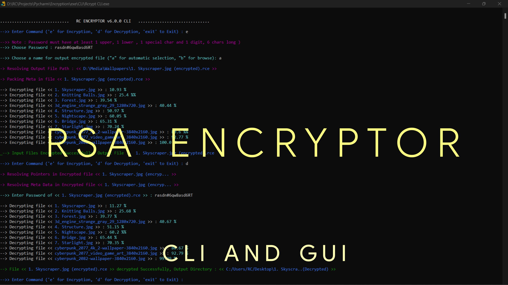
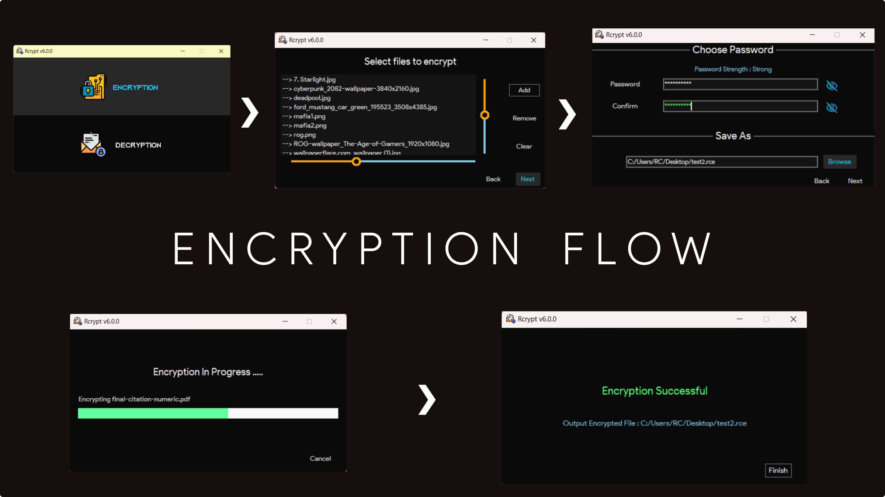
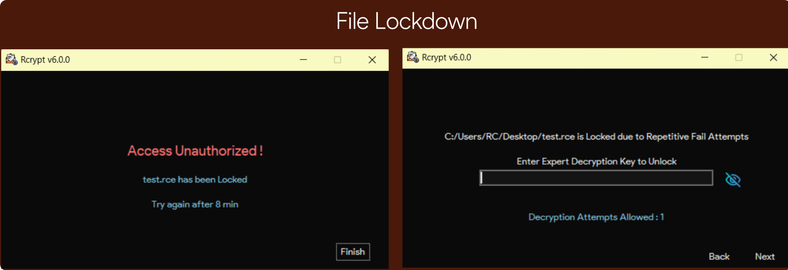
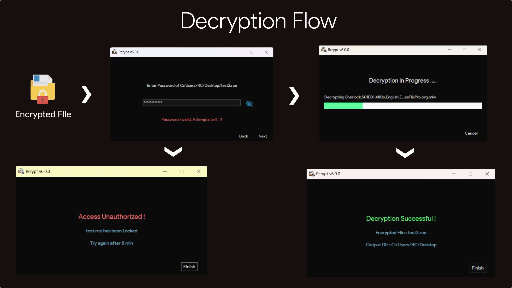
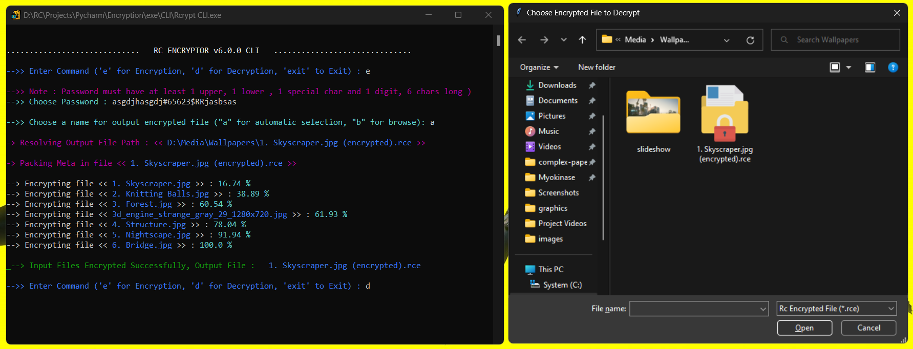

# RCrypt: RSA Encryption Software

An Encryption Software made from scratch in python, based on the asymmetric RSA cryptographic system

##### Watch Demonstrations on YouTube
[RCrypt Playlist](https://www.youtube.com/playlist?list=PL_oeaRvQxDbSbeZ1X5A_xxczKjxGeQTvH)  
[Rcrypt Command Line Interface](https://youtu.be/RJWuZjVnxG8)  
[Rcrypt Graphical User Interface](https://youtu.be/fG_VI7kVobM)  

###### See also  
[Fourier Series Simulation](https://github.com/ChauhanRohan-RC/Fourier-Series.git)  
[3D N*N Rubik's Cube solver-AI](https://github.com/ChauhanRohan-RC/Cube.git)  
[Path Finder Simulation](https://github.com/ChauhanRohan-RC/PathFinder.git)

## Algorithm
* Uses a custom encryption algorithm with separate implementations for text and binary data, based on the asymmetric RSA Cryptographic system
* Both Command Line (CLI) and User Interface (GUI) versions
* Supports every type of file format, including but not limited to 
  * text files : transformer-based encryption protocol for utf encoded files
  * images : Bitmap encoding to BASE64
  * audio-video and multimedia
  * Any other binary file
* Encrypt multiple files (of any type) in a single Batch Encrypted File (BEF)

## Security Features

* Initial Encrypted file lockdown after 3 unauthorized attempts
* After the initial lockdown, cooldown time increases exponentially with each unauthorized attempt
* Permanent lockdown after repeated unauthorized attempts
* Read-Write restrictions
* Anti-tamper protection from ransomware and resource abuse

####

## Usage
### Windows
* Command Line interface executable: [Rcrypt CLI](exe/CLI/Rcrypt%20CLI.exe)
* GUI setup zip: [Rcrypt Setup](exe/GUI/Rcrypt_setup.zip)
* To start RCrypt, run `RCrypt.exe`
* To Encrypt multiple files at once, select the files and  
`Right Click (context menu)-> Send To -> Add to Encrypted File`
* To fix registry entries, go the installation folder and run `REG.exe`
* To uninstall the software, go to control panel. Alternatively, go to installation folder and run `Uninstall.exe` 

### Python
* clone the repository  
`git clone https://github.com/ChauhanRohan-RC/RSA-Encryptor.git`
* For the command line interface, open the terminal and run  
`python CLI.py`

####

####

* For the GUI version, open the terminal and run
`python UI.__init__.py`
* For the registry fixes (windows only), run command  
`python reg.py`

## Support
* E-mail: `com.production.rc@gmail.com`
* To report any bugs or suggestions, open an issue on GitHub or contact via E-mail. 
* If the encrypted file gets locked due to multiple Unauthorised Access, send a mail to above address

## Connect on
[Twitter](https://twitter.com/0rc_studio)  
[YouTube](https://www.youtube.com/channel/UCmyvutGWtyBRva_jrZfyORA)  
[Google Play Store](https://play.google.com/store/apps/dev?id=7315303590538030232)
